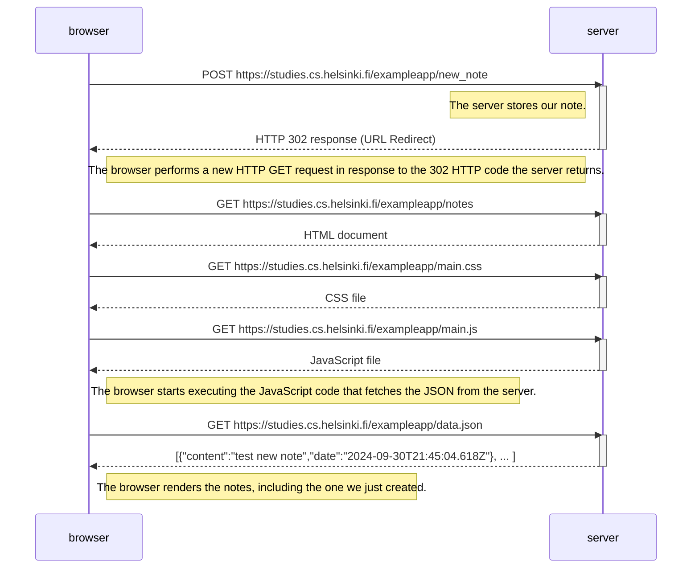

```mermaid
sequenceDiagram
    participant browser
    participant server

    browser->>server: POST https://studies.cs.helsinki.fi/exampleapp/new_note

    activate server

    Note left of server: The server stores our note.

    server-->>browser: HTTP 302 response (URL Redirect)
    deactivate server

    Note right of browser: The browser performs a new HTTP GET request in response to the 302 HTTP code the server returns.
    
    browser->>server: GET https://studies.cs.helsinki.fi/exampleapp/notes
    activate server
    server-->>browser: HTML document
    deactivate server

    browser->>server: GET https://studies.cs.helsinki.fi/exampleapp/main.css
    activate server
    server-->>browser: CSS file
    deactivate server

    browser->>server: GET https://studies.cs.helsinki.fi/exampleapp/main.js
    activate server
    server-->>browser: JavaScript file
    deactivate server

    Note right of browser: The browser starts executing the JavaScript code that fetches the JSON from the server.

    browser->>server: GET https://studies.cs.helsinki.fi/exampleapp/data.json
    activate server
    server-->>browser: [{"content":"test new note","date":"2024-09-30T21:45:04.618Z"}, ... ]
    deactivate server

    Note right of browser: The browser renders the notes, including the one we just created.
```