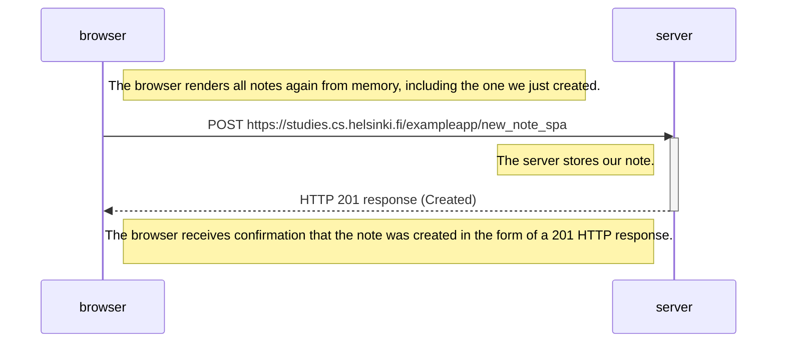

```mermaid
sequenceDiagram
    participant browser
    participant server
    
    Note right of browser: The browser renders all notes again from memory, including the one we just created.

    browser->>server: POST https://studies.cs.helsinki.fi/exampleapp/new_note_spa
    activate server

    Note left of server: The server stores our note.
    
    server-->>browser: HTTP 201 response (Created)
    
    deactivate server


    Note right of browser: The browser receives confirmation that the note was created in the form of a 201 HTTP response.<br>
```