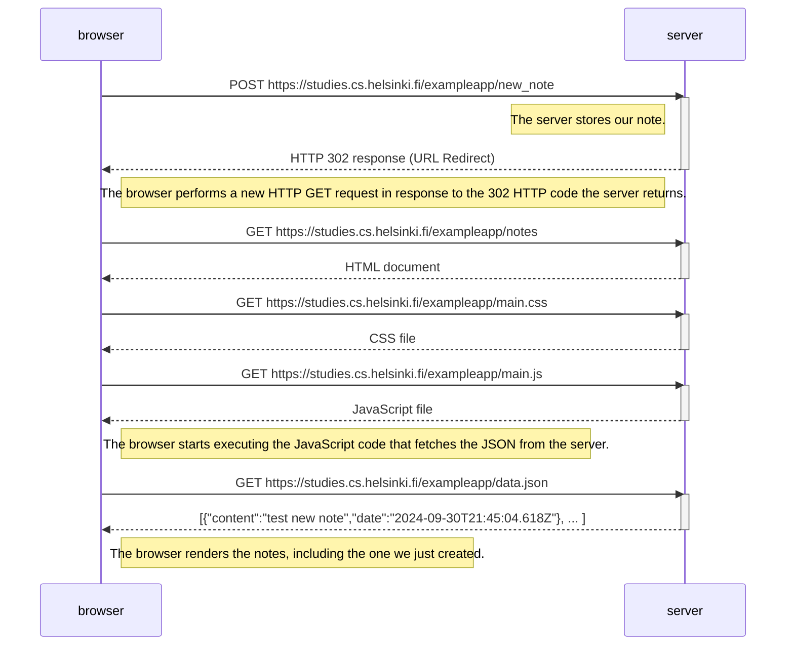
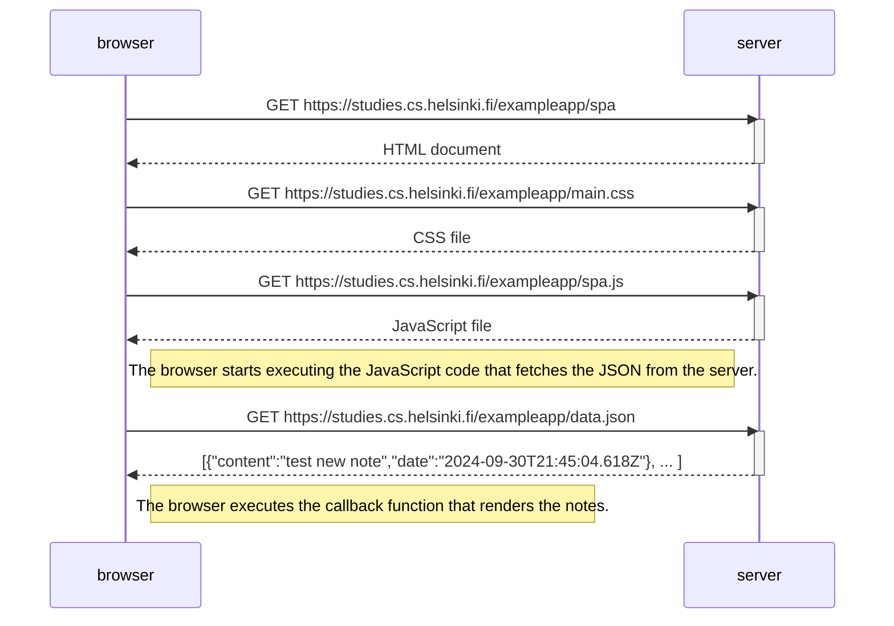
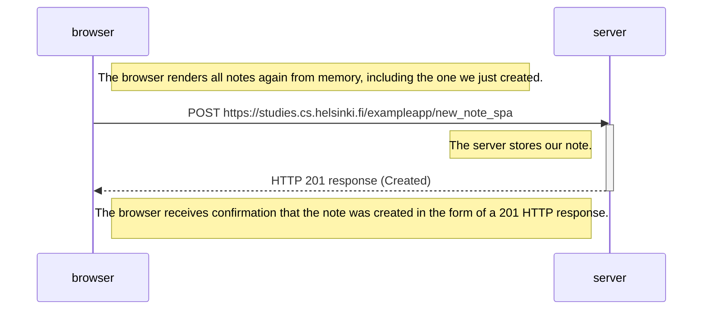

# Part 0: Fundamentals of Web apps 

## Excercises

### 0.4: New note diagram

Create a similar diagram depicting the situation where the user creates a new note on the page https://studies.cs.helsinki.fi/exampleapp/notes by writing something into the text field and clicking the Save button.

### 0.5: Single page app diagram

Create a diagram depicting the situation where the user goes to the single-page app version of the notes app at https://studies.cs.helsinki.fi/exampleapp/spa.

### 0.6: New note in Single page app diagram

Create a diagram depicting the situation where the user creates a new note using the single-page version of the app.

